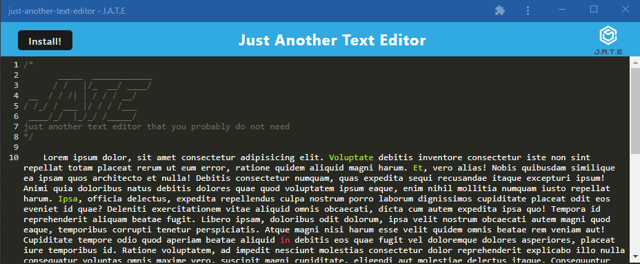

# A-Text-Editor-You-Do-Not-Need

[](https://opensource.org/licenses/MIT)
[](code_of_conduct.md)

## Description 
A text-editor that runs in the browser.  The app is a single page application that meets the PWA criteria.  The application will also function offline.  Data  is persisted in an IndexedDb database with local storage and default headers as redundancies.

[Deployed link](https://salty-shore-55684.herokuapp.com/)
Git clone - git@github.com:espinbrandon49/Seen-Accessibility.git

[](https://salty-shore-55684.herokuapp.com/)


## Table of Contents

* [Usage](#usage)
* [Contribution](#contributing)
* [Installation](#installation)
* [Collaboration](#collaboration)
* [License](#license)
***

## Usage 

To use the site visit the live link above. You can create notes or code snippets with or without an internet connection so that you can reliably retrieve them for later use

## Contributing

To contribute, send in a pull request! 
[Contributor Covenant](https://www.contributor-covenant.org/)

## Installation

Browser:
* Runs in the browser
* Deployed Link: [https://salty-shore-55684.herokuapp.com/](https://salty-shore-55684.herokuapp.com/)

Clone:

Download and install [Node.js](https://nodejs.org/en/download/)
Clone the repository
```bash
git@github.com:espinbrandon49/A-Text-Editor-You-Do-Not-Need.git
```
Run npm install to install the npm dependencies from the [package.json](./package.json)
```bash
npm install
```

## Collaboration
### Jerome Chennete

## License 
### MIT License 
The content of this application is licensed under the MIT License. 